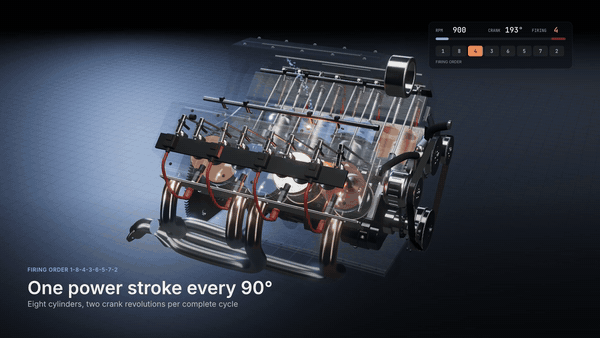
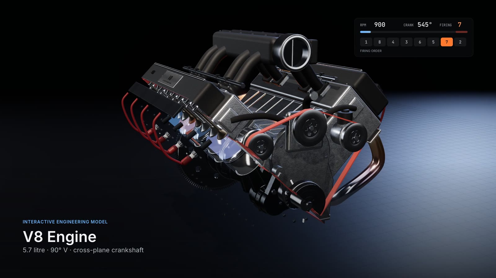
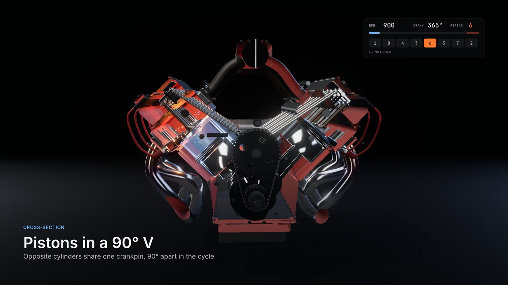
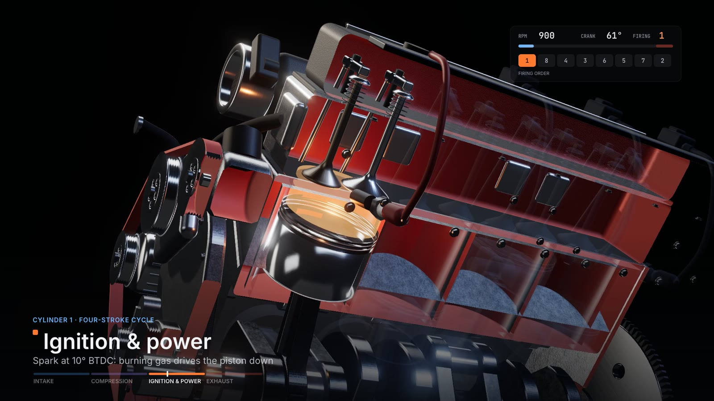
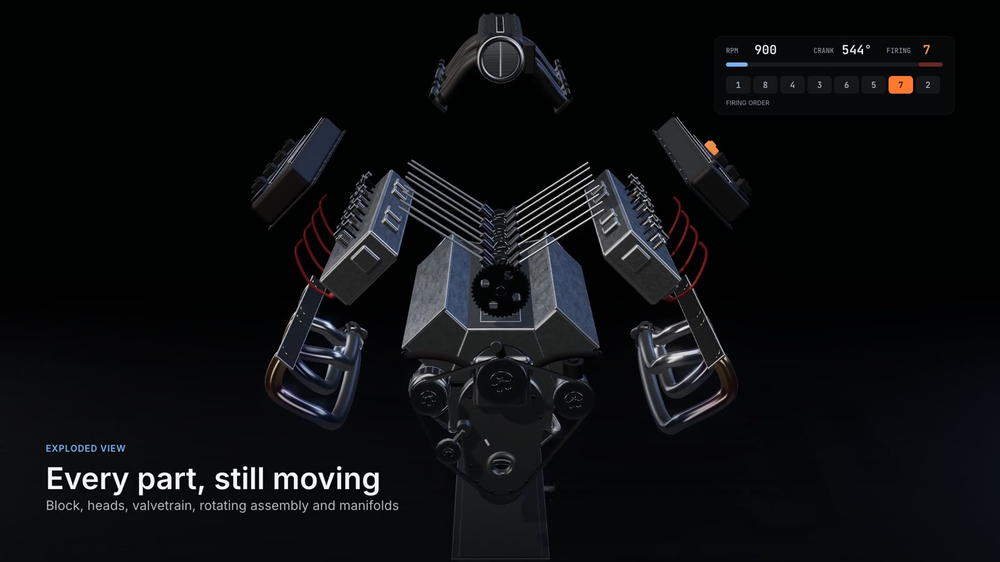
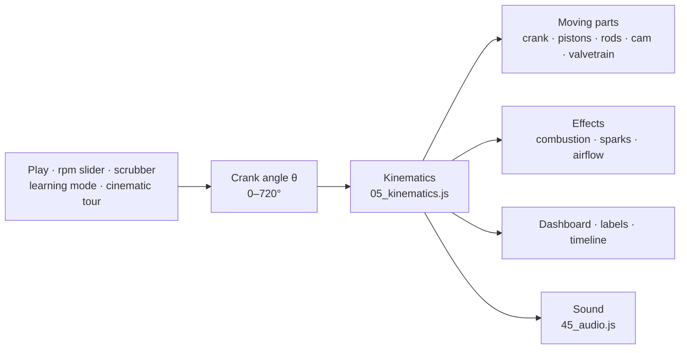
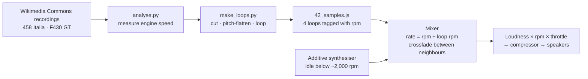
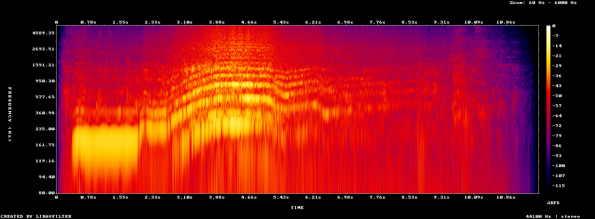
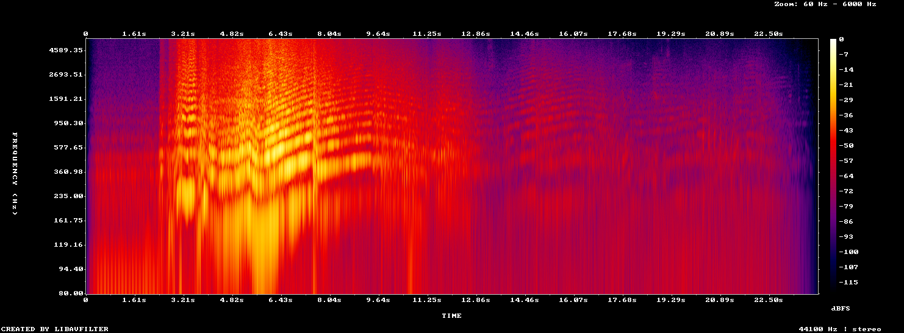

# V8 Engine Explorer

[](https://github.com/ssabeeth/v8-engine-explorer/actions/workflows/ci.yml)


**An interactive V8 you can take apart in your browser.** Spin it, slice it open, explode it into its parts, step through the four‑stroke cycle one crank degree at a time, and rev it to 8,000 rpm with sound built from real Ferrari V8 recordings.

### **[▶ Open the live demo](https://ssabeeth.github.io/v8-engine-explorer/)** · [Watch the 70‑second tour](https://github.com/ssabeeth/v8-engine-explorer/releases/latest)



| | |
|---|---|
|  |  |
|  |  |

**What makes it interesting**

- **Everything moves from one number.** A single crank angle drives all the moving parts: the crankshaft, eight pistons and rods, the camshaft, 16 lifters, pushrods, rockers and valves, the flywheel, pulleys and timing chain. It also drives the combustion effects, the dashboard and the sound. Scrub the timeline and all of it stays in step.
- **The mechanism is checked, not just drawn.** Firing order, rod length, dead‑centre timing and valve‑to‑piston clearance are unit‑tested on every push.
- **The sound is measured, not guessed.** Engine speed was read from each recording's spectrum, and the loops are regenerated byte for byte by scripts in this repo.
- **One file, no install.** No model files, no image files and no server. The whole thing is a single `index.html`.

---

## Contents

- [Using it](#using-it)
- [How it's built](#how-its-built)
  - [One crank angle drives everything](#one-crank-angle-drives-everything)
  - [The engine being modelled](#the-engine-being-modelled)
  - [Procedural 3D model](#procedural-3d-model)
  - [Materials, lighting and graphics presets](#materials-lighting-and-graphics-presets)
  - [Cutaway, transparency and exploded view](#cutaway-transparency-and-exploded-view)
  - [Combustion and airflow effects](#combustion-and-airflow-effects)
  - [Engine sound](#engine-sound)
  - [Cinematic tour and video rendering](#cinematic-tour-and-video-rendering)
  - [Single-file build](#single-file-build)
- [How it's verified](#how-its-verified)
- [Limitations](#limitations)
- [Development](#development)
- [Credits and licences](#credits-and-licences)

---

## Using it

Open the **[live demo](https://ssabeeth.github.io/v8-engine-explorer/)**, or download `index.html` and open it in Chrome, Safari, Firefox or Edge. It needs an internet connection the first time, to load three.js and the fonts.

**Mouse or trackpad:** drag to rotate, scroll to zoom, right‑drag to pan. Click a part to see what it does, what it connects to and what happens if it fails. Double‑click a part to fly the camera to it.

| Key | Action | Key | Action |
|---|---|---|---|
| Space | Play / pause | `1`–`8` | Select a cylinder |
| `R` | Reset camera | Esc | Clear selection |
| `E` | Exploded view | `M` | Sound on / off |
| `T` | Transparent shell | `V` | Rev to 8,000 rpm |
| `L` | Cylinder labels | `P` | Cinematic tour |

**Panels:**

- **Playback:** play/pause, slow motion (1/20 speed), an rpm slider (300–9,000), a 0–720° crank scrubber and the sound controls.
- **Camera:** ten presets, from full engine and front to crankshaft, piston, combustion chamber, intake, exhaust and either bank.
- **Cutaway:** a section cut through either bank or across the engine, shell transparency, and an adjustable exploded view.
- **Systems:** show or hide the block, heads, pistons, rods, crankshaft, valves, camshaft, spark plugs, intake, exhaust, flywheel, accessories, labels and flow effects.
- **Cylinders:** select one and solo it (the others fade out).
- **Learning mode:** focuses one cylinder and walks through intake, compression, ignition/power and exhaust, with live valve lift and piston position.
- **Timeline** (bottom of the screen): the selected cylinder's valve‑lift diagram and strokes across the full 720° cycle, with the firing order below. Drag it to scrub.

---

## How it's built

About 2,800 lines of JavaScript on top of [three.js](https://threejs.org) (0.169, loaded from jsDelivr through an import map), plus the Web Audio API for sound. It has no framework and no bundler.



### One crank angle drives everything

Each frame advances a single number, the crank angle θ, by `rpm / 60 × 360 × Δt` (× 1/20 in slow motion). Everything else is derived from it:

| Part | Derived from θ |
|---|---|
| Crankshaft, flywheel | rotate by −θ (clockwise viewed from the front) |
| Camshaft | rotates by −θ/2 (half crank speed, driven by a 20:40‑tooth chain drive) |
| Pistons, rods | slider‑crank solved in each bank's own frame (below) |
| Valves | lift profile per cylinder: `sin²(π·t)` over a 260° event |
| Rockers | tilt by `asin(lift / 24 mm)`, a 1.5:1 ratio |
| Lifters, pushrods | lifters rise `lift / 1.5`; each pushrod is re‑stretched between lifter and rocker cup every frame |
| Pulleys, belt, chain | speed ratio from pulley radii; the chain texture scrolls at sprocket speed |
| Throttle blade | opens with rpm |

Piston travel along the bore, for crank throw *r* and rod length *L*:

```
s(θ) = r·cos φ + √(L² − (r·sin φ)²)      φ = crankpin angle − θ − bank angle
```

The rod angle comes from the same triangle, so the rod's big end always sits on its crankpin and its small end on the wrist pin. The tests check this at every quarter‑degree.

### The engine being modelled

| | |
|---|---|
| Layout | 90° V8, pushrod valvetrain with a single camshaft in the V, left bank forward |
| Displacement | 5.7 L: 101.6 mm bore × 88.4 mm stroke, 144.8 mm rods |
| Crankshaft | cross‑plane: pins at 45°, 135°, 225° and 315°, each shared by opposite‑bank cylinders |
| Firing order | **1‑8‑4‑3‑6‑5‑7‑2**, one cylinder every 90° |
| Valve events | intake opens 20° BTDC and closes 60° ABDC; exhaust opens 60° BBDC and closes 20° ATDC |
| Valve lift | 11.5 mm, 1.5:1 rockers |
| Ignition | 10° BTDC (fixed) |

The crankpin angles aren't hard‑coded. Each cylinder's pin angle is solved from its bank angle and when it should fire (`pin = bank angle + firing angle`). That reproduces the classic cross‑plane layout, and a test confirms that opposite‑bank pairs land on the same pin.

Each cam lobe is built from the same lift curve the valves use. Its nose is rotated to `bank angle + (firing angle + peak‑lift angle) / 2`, so it points straight at its lifter at the moment of peak lift.

### Procedural 3D model

There are no model files. Every part is generated in code from three.js primitives:

- **Extruded profiles:** the block's crankcase cross‑section; crank webs with counterweights; I‑beam connecting rods; sprockets and the flywheel ring gear with real tooth counts.
- **Lathed profiles:** pistons with ring lands and grooves; tulip‑shaped valves; pulleys with belt ribs; the harmonic balancer; spark plugs; the throttle body.
- **Tubes along curves:** exhaust headers routed as 4‑into‑1 per bank; intake runners; coolant hoses; spark‑plug leads.
- **Helix curves** for the valve springs, which compress as the valves open.

Static parts are merged per material with `BufferGeometryUtils.mergeGeometries` to keep draw calls low, and the 130‑odd bolts are drawn as `InstancedMesh`.

### Materials, lighting and graphics presets

- **PBR materials** (`MeshPhysicalMaterial`) for cast aluminium, machined and polished steel, forged rods, rubber, ceramic and composite.
- **Procedural textures** drawn on a `<canvas>` at startup: layered value noise for the sand‑cast surface, fine lines for brushed metal, a chain‑link strip, and the engraved valve‑cover plate. There are no image files.
- **Header heat tint:** straw to bronze to blue near the ports, fading to bare steel, using vertex colours along each tube.
- **Studio reflections without an HDR file:** a small scene of glowing "softbox" panels is rendered into a pre‑filtered environment map (`PMREMGenerator`), which gives the long highlights of a product‑photography studio.
- **Post‑processing:** ACES filmic tone mapping, soft shadows, and a subtle bloom that only catches HDR highlights such as sparks and combustion.

| Preset | Pixel ratio | Shadow map | Bloom | Flow particles |
|---|---|---|---|---|
| High | up to 2× | 2048 | on | 1,800 |
| **Balanced** (default) | up to 1.5× | 1024 | on | 900 |
| Performance | 1× | off | off | 320 |

### Cutaway, transparency and exploded view

- **Section cut.** A clipping plane either runs through one bank's bore axes, or crosses the engine at any position along the crank. Only the outer castings and manifolds are clipped, so the moving parts stay whole inside.
- **Red cut faces.** A small shader injection (`onBeforeCompile`) paints the inside faces of clipped castings in the classic cutaway red, but only while a cut is active.
- **Transparency** fades the castings. Cylinder liners, hidden otherwise, appear as thin glassy tubes so you can see the bores.
- **Exploded view** moves each group along its own axis: heads and valve covers up their bank, the rotating assembly down, the intake up, headers outward, accessories forward. Everything keeps running while it does.
- **Clicking parts** uses a raycaster that ignores anything cut away, see‑through shells, and faded‑out cylinders in solo mode, so clicks reach the part you're looking at.

### Combustion and airflow effects

- **Gas column.** Each cylinder has a column of gas between the piston crown and the chamber roof that resizes with the piston and changes colour with the stroke: faint blue on intake, denser violet‑blue on compression, white‑yellow to orange on combustion, dull red on exhaust.
- **Spark and flash.** A spark sprite fires at 10° BTDC, and a single moving point light follows whichever cylinder is firing.
- **Airflow particles.** Intake and exhaust particles follow pre‑computed paths: from the plenum, down the runner, past the valve and into the cylinder, or out through the header to the collector. Their brightness follows the live valve lift, and they're clipped by the same section plane as the castings.

### Engine sound



**Reading engine speed from a recording.** A V8 fires four times per crank revolution, so the firing frequency is rpm ÷ 15 Hz. [`tools/sound/analyse.py`](tools/sound/analyse.py) finds that line in each recording's spectrum and tracks it over time. Results are in [`results/sound_analysis.json`](results/sound_analysis.json):

| Recording (Wikimedia Commons) | Section | Measured | Used as |
|---|---|---|---|
| Ferrari 458 Italia, Goodwood 2010 | 0.5–1.8 s, holding revs at the start | 198.5 Hz → **2,977 rpm** | loop 1 |
| | 2.95–4.65 s, first‑gear pull | **2,708 → 4,489 rpm** | loop 2, **4,438 rpm** |
| Ferrari F430 GT, Goodwood 2010 | 5.9–7.45 s, accelerating past the mic | **4,948 → 7,646 rpm** | loops 3 and 4, **6,040** and **7,252 rpm** |




**Turning a sweep into a loop.** The F430 GT's revs rise the whole way through the recording, so looping it as recorded would warble. [`make_loops.py`](tools/sound/make_loops.py) follows the firing line through the sweep and resamples two slices at a time‑varying rate (target pitch ÷ measured pitch), which holds each at a constant pitch before a crossfaded loop seam. Re‑measured afterwards, the loops sit at 6,040 and 7,252 rpm for targets of 6,050 and 7,250. Re‑running the script rebuilds `src/42_samples.js` byte for byte.

**Playing it back:**

- **Recorded loops.** The mixer plays each loop at `current rpm ÷ recorded rpm` and crossfades neighbouring loops around the middle of their gap, so every loop stays close to its natural pitch. At 8,000 rpm the top loop is sped up only 1.1×. Per‑loop level trims keep loudness flat within 0.6 dB from 2,000 to 8,000 rpm. The rise you hear during a rev comes from a deliberate rpm × throttle curve.
- **Synthesiser (idle and the alternative profiles).** An `AudioWorklet` builds the sound from harmonics of the 720° engine cycle, locked to the crank angle. Each bank's exhaust gets its own set of harmonics, determined by which firing slots feed it. That's what makes a flat‑plane engine shriek and a cross‑plane engine burble. A fixed "exhaust resonance" curve shapes the tone as the harmonics sweep through it. The same generator class runs in a `ScriptProcessorNode` where worklets aren't available.
- **Revs and overrun.** Throttle is inferred from how fast the rpm is changing, so the tone brightens under load and dulls on the overrun. There are random exhaust pops when lifting off above 2,400 rpm.
- **Slow motion.** Real engine sound at 1/20 speed would be meaningless, so each firing plays a short combustion "thump" at the exact crank angle it happens, panned to that cylinder's bank.

### Cinematic tour and video rendering

The tour (`P`) is a script of seven camera shots over 70 seconds: hero view, cross‑section, a four‑stroke close‑up, transparent engine, exploded view, a free‑rev and a finale. Each shot sets up the view (cut, transparency, solo, explode) and eases the camera along a path. Captions and a live crank/rpm gauge are drawn on a 2D canvas over the 3D view.

The same script renders to video frame by frame. `window.__v8.capture` steps the simulation at exactly 1/60 s per frame, whatever the machine's speed. It composites the 3D canvas and the caption canvas at 1920×1080 and posts each frame to a small local server ([`tools/video/capserver.py`](tools/video/capserver.py)).

The soundtrack is rendered separately with an `OfflineAudioContext`: the rpm and throttle recorded for every frame automate the sound engine, and every logged firing event is placed at its exact time. That makes the audio sample‑accurate to the picture. ffmpeg then combines the two into the MP4 in the release.

### Single-file build

`build.sh` concatenates the files in `src/` into one ES module inside `index.html`. Import declarations are hoisted, so the dependency‑free kinematics file can sit ahead of the three.js imports and be tested on its own. The sound loops are embedded as base64 WAV data URIs, so the page loads nothing but three.js and two fonts.

```
src/
  00_head.html       page markup and styles
  05_kinematics.js   pure engine maths: no DOM, no three.js (unit-tested)
  10_core.js         renderer, studio lighting, materials, geometry helpers
  20_build.js        procedural engine model
  30_sim.js          animation, effects, cutaway, exploded view, picking, cameras
  40_ui.js           panels, dashboard, timeline, learning mode, render loop
  42_samples.js      generated sound loops (tools/sound/make_loops.py)
  45_audio.js        sound engine: recorded loops + synthesiser
  50_tour.js         cinematic tour and frame-by-frame capture
  99_tail.html       error handling
tests/               node --test
tools/sound/         recording analysis and loop generation (Python, numpy, ffmpeg)
tools/video/         local capture server for rendering the tour
results/             measured numbers quoted in this README
```

---

## How it's verified

[`tests/mechanism.test.mjs`](tests/mechanism.test.mjs) runs on every push ([CI](.github/workflows/ci.yml)) against the pure kinematics module:

- **Firing order:** 1‑8‑4‑3‑6‑5‑7‑2, one cylinder every 90°.
- **Crankpins:** opposite‑bank pairs share a pin; the pins sit at 45°, 135°, 225° and 315°.
- **Rod length:** constant to within 10⁻¹² at every quarter‑degree of the cycle, for all eight cylinders.
- **Dead centres:** each piston is at top dead centre when it fires and 360° later, and at bottom dead centre 180° after firing.
- **Piston crown:** flush with the block deck at top dead centre.
- **Valve clearance:** valves stay more than 3 mm from the piston at every crank angle (the minimum is 4.2 mm).
- **Valve timing:** valves open only on the correct strokes, with overlap around top dead centre between exhaust and intake.
- **Firing indicator:** the "firing now" readout steps through the firing order.

CI also rebuilds `index.html` from `src/` and fails if the committed file is out of date.

---

## Limitations

- **Pitch vs speed ambiguity (458).** Reading engine speed from pitch has one ambiguity. A flat‑plane V8 produces both a firing line (rpm/15) and a per‑bank line an octave lower (rpm/30). In the F430 GT recording both are clearly present, so its reading is certain. In the 458 recording the energy sits at 294 Hz and its third harmonic, with little at half that frequency. That fits 294 Hz being the firing line, but if it were the per‑bank line the 458 loops would really be about twice the labelled rpm. The harmonic levels behind this call are in `results/sound_analysis.json`.
- **Two different cars.** The two recordings come from different cars at different distances from the microphone, so the character changes slightly in the crossfade between about 4,400 and 6,000 rpm. Above about 5,500 rpm you hear a GT race car with a straight‑through exhaust.
- **Crank type mismatch.** The recordings are flat‑plane Ferraris, while the modelled engine is a cross‑plane V8. The synthesiser profiles let you compare the two sounds.
- **Kinematics only, not dynamics.** Ignition timing is fixed at 10° BTDC, and there's no combustion pressure, friction or engine dynamics.
- **Real‑time aliasing.** With slow motion off at high rpm, the parts move faster than the display can show, so they appear to strobe.

---

## Development

```sh
./build.sh                          # rebuild index.html after editing src/
node --test tests/                  # mechanism tests
python tools/sound/analyse.py       # re-measure the recordings -> results/, docs/img/
python tools/sound/make_loops.py    # regenerate src/42_samples.js
python tools/video/capserver.py     # serve the repo for tour capture
```

To render the tour, start the capture server, open `http://127.0.0.1:8765/index.html`, and drive `window.__v8.capture` from the browser console:

```js
const C = __v8.capture, fps = 60, n = C.begin(1920, 1080, 'high') * fps;
for (let i = 0; i < n; i++) await fetch('/frame/' + i, { method: 'POST', body: await C.frame(1 / fps) });
await fetch('/audio/tour.wav', { method: 'POST', body: await C.audio('rec') });
```

Then encode:

```sh
ffmpeg -framerate 60 -i frames/f%05d.jpg -i tour.wav -c:v libx264 -crf 17 -pix_fmt yuv420p -c:a aac -b:a 192k tour.mp4
```

---

## Credits and licences

- **Code:** MIT (see [LICENSE](LICENSE)).
- **Engine‑sound loops** in `src/42_samples.js` (embedded in `index.html`) are derived (trimmed, pitch‑flattened, looped, level‑matched) from recordings by **Edvvc** on Wikimedia Commons. They're shared under **[CC BY‑SA 3.0](https://creativecommons.org/licenses/by-sa/3.0/)**:
  - [“Ferrari 458 Italia”](https://commons.wikimedia.org/wiki/File:Ferrari_458_Italia.ogg)
  - [“Ferrari F430 (2010)”](https://commons.wikimedia.org/wiki/File:Ferrari_F430_(2010).ogg)
- **[three.js](https://threejs.org):** MIT.
- **Inter and JetBrains Mono:** SIL Open Font License, via Google Fonts.
